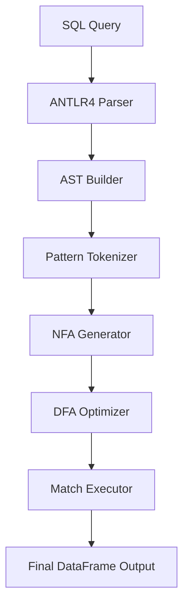

# SQL MATCH\_RECOGNIZE on Pandas

## Overview

This project brings SQL’s powerful `MATCH_RECOGNIZE` clause—used for pattern matching in sequences and event streams—directly to Pandas DataFrames. Our implementation allows users to run complex sequence detection logic in-memory within Python, removing the need for external databases like Trino, Oracle, or Flink.

It supports the SQL:2016 standard for `MATCH_RECOGNIZE`, including advanced features such as:

* `PARTITION BY`, `ORDER BY`
* Regex-style pattern syntax
* `DEFINE` conditions
* `AFTER MATCH SKIP` options
* Support for anchors, quantifiers, alternation, and `PERMUTE` patterns

---

## Motivation

Existing platforms like Oracle, Trino, and Flink offer robust implementations of `MATCH_RECOGNIZE` but come with significant complexity, licensing, or deployment overhead. Python's Pandas, despite its widespread use, lacks direct support for expressive pattern queries.

This project aims to close that gap by enabling SQL-native pattern detection in Pandas without sacrificing performance or expressiveness.

---

## Key Features

* 🧠 **SQL Query Parsing with ANTLR4**
  Fully customized SQL grammar extended from Trino to support all aspects of the `MATCH_RECOGNIZE` clause.

* 🌲 **AST Construction**
  SQL queries are parsed and transformed into abstract syntax trees for easier validation and execution.

* ⚙️ **Finite Automata Engine**

  * Patterns are tokenized and translated to NFAs using Thompson’s construction.
  * NFAs are converted to DFAs for efficient row-by-row evaluation.
  * DFA optimizations include state minimization and prioritization.

* 📊 **Execution on Pandas**

  * Data is partitioned and ordered per query.
  * Patterns are matched directly on DataFrames.
  * Results are formatted to resemble SQL query output.

* 🧪 **Safety and Expressiveness**

  * Custom error listener for precise SQL diagnostics.
  * SQL-to-Python conversion uses the `ast` module to safely evaluate expressions.

---

## Architecture



---

## Example SQL Query

```sql
SELECT *
FROM trade_events
MATCH_RECOGNIZE (
  PARTITION BY symbol
  ORDER BY event_time
  MEASURES
    A.event_time AS start_time,
    B.event_time AS peak_time
  PATTERN (A+ B)
  DEFINE
    A AS A.price < B.price,
    B AS B.price > PREV(B.price)
)
```

---

## Getting Started

### Prerequisites

* Python 3.8+
* `pandas`
* `antlr4-python3-runtime`
* `lark` (optional, if using alternative parser)

### Installation

```bash
pip install -r requirements.txt
```

---

## Run Example

```python
from match_recognize import MatchRecognize

sql = """SELECT *
FROM trades
MATCH_RECOGNIZE (
  PARTITION BY symbol
  ORDER BY event_time
  MEASURES A.event_time AS start_time, B.event_time AS peak_time
  PATTERN (A+ B)
  DEFINE
    A AS A.price < B.price,
    B AS B.price > PREV(B.price)
)"""

df = load_trade_data()
result = MatchRecognize(sql).run(df)
print(result)
```


## Limitations

* Performance is limited by available system memory (in-memory only).
* Some advanced pattern features (`UNTIL`, `FINAL`, `RUNNING`) are experimental.
* Currently supports a subset of SQL aggregate functions.


## 📚 References

- [Oracle MATCH_RECOGNIZE Docs](https://docs.oracle.com/cd/E29542_01/apirefs.1111/e12048/pattern_recog.htm#CQLLR1531)
- [Flink SQL MATCH_RECOGNIZE](https://nightlies.apache.org/flink/flink-docs-release-1.15/docs/dev/table/sql/queries/match_recognize/)
- [Trino Row Pattern Recognition](https://trino.io/docs/current/sql/match-recognize.html)

---

## 🤝 Contributing

Pull requests and feedback are welcome! Please ensure your code is tested and documented.

---

## 📝 License

This project is licensed under the MIT License.
