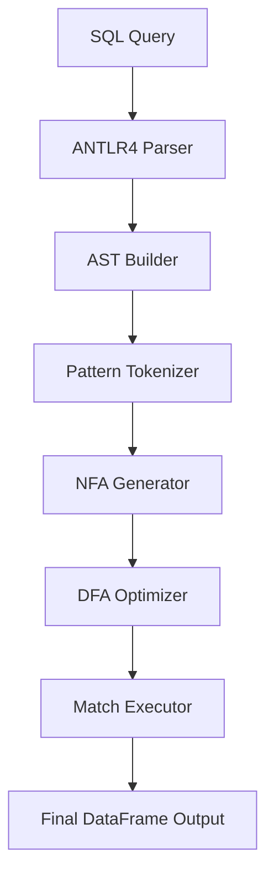

# SQL MATCH\_RECOGNIZE on Pandas

## Overview

This project brings SQL’s powerful `MATCH_RECOGNIZE` clause—used for pattern matching in sequences and event streams—directly to Pandas DataFrames. Our implementation allows users to run complex sequence detection logic in-memory within Python, removing the need for external databases like Trino, Oracle, or Flink.

It supports the SQL:2016 standard for `MATCH_RECOGNIZE`, including advanced features such as:

* `PARTITION BY`, `ORDER BY`
* Regex-style pattern syntax
* `DEFINE` conditions
* `AFTER MATCH SKIP` options
* Support for anchors, quantifiers, alternation, and `PERMUTE` patterns

---

## Motivation

Existing platforms like Oracle, Trino, and Flink offer robust implementations of `MATCH_RECOGNIZE` but come with significant complexity, licensing, or deployment overhead. Python's Pandas, despite its widespread use, lacks direct support for expressive pattern queries.

This project aims to close that gap by enabling SQL-native pattern detection in Pandas without sacrificing performance or expressiveness.

---

## Key Features

* 🧠 **SQL Query Parsing with ANTLR4**
  Fully customized SQL grammar extended from Trino to support all aspects of the `MATCH_RECOGNIZE` clause.

* 🌲 **AST Construction**
  SQL queries are parsed and transformed into abstract syntax trees for easier validation and execution.

* ⚙️ **Finite Automata Engine**

  * Patterns are tokenized and translated to NFAs using Thompson’s construction.
  * NFAs are converted to DFAs for efficient row-by-row evaluation.
  * DFA optimizations include state minimization and prioritization.

* 📊 **Execution on Pandas**

  * Data is partitioned and ordered per query.
  * Patterns are matched directly on DataFrames.
  * Results are formatted to resemble SQL query output.

* 🧪 **Safety and Expressiveness**

  * Custom error listener for precise SQL diagnostics.
  * SQL-to-Python conversion uses the `ast` module to safely evaluate expressions.

---

## Architecture



---

## Example SQL Query

```sql
SELECT *
FROM trade_events
MATCH_RECOGNIZE (
  PARTITION BY symbol
  ORDER BY event_time
  MEASURES
    A.event_time AS start_time,
    B.event_time AS peak_time
  PATTERN (A+ B)
  DEFINE
    A AS A.price < B.price,
    B AS B.price > PREV(B.price)
)
```

---

## Getting Started

### Prerequisites

* Python 3.8+
* `pandas`
* `antlr4-python3-runtime`
* `lark` (optional, if using alternative parser)

### Installation

```bash
pip install -r requirements.txt
```

---

## Run Example

```python
from match_recognize import MatchRecognize

sql = """SELECT *
FROM trades
MATCH_RECOGNIZE (
  PARTITION BY symbol
  ORDER BY event_time
  MEASURES A.event_time AS start_time, B.event_time AS peak_time
  PATTERN (A+ B)
  DEFINE
    A AS A.price < B.price,
    B AS B.price > PREV(B.price)
)"""

df = load_trade_data()
result = MatchRecognize(sql).run(df)
print(result)
```


## Conclusion and Future Work

### Current Limitations

Despite the system's comprehensive capabilities, several limitations remain. First, **complex pattern and quantifier interactions**: although the system supports concatenation, alternation, grouping, and standard quantifiers (`*`, `+`, `?`, `{n,m}`), certain combinations—particularly multiple greedy quantifiers nested within groups (e.g., `(A+B*)+C?`)—can trigger exponential state-space growth during automata construction. This issue primarily arises with three or more levels of nesting combined with unbounded quantifiers; by contrast, simpler patterns and bounded quantifiers behave efficiently. Second, **limited support for aggregate functions**: while a wide range of built-in aggregates (including conditional and statistical functions) is supported, the current implementation offers only limited support for user-defined aggregate functions.

### Future Work

We plan to extend the engine through some updates:

**Performance on Large Datasets:** The system performs efficiently on moderate-sized datasets but may require additional optimizations for large datasets.

**Memory Usage for Large Patterns:** Patterns with many variables and complex quantifiers can generate large automata that increase memory consumption.

**Integration with Query Optimizers:** Because the pattern-matching engine currently operates independently of database query optimizers, it may miss plan-level optimization opportunities.

### Conclusion

We presented a SQL-in-`pandas` engine for executing `MATCH_RECOGNIZE` queries over DataFrames. This provides `SQL:2016 MATCH_RECOGNIZE` functionality for `pandas` DataFrames, bridging the gap between the expressiveness of relational queries and the flexibility of in-memory analytics, bringing SQL pattern matching capabilities to Python data science workflows. This opens the door to unified and portable pipelines that preserve both semantics and developer productivity.

`MATCH_RECOGNIZE` allows data scientists and analysts to use powerful pattern-matching semantics directly within their familiar Pandas environment, without the need for complex Python code or external SQL engine dependencies. This reduces development complexity and enhances productivity for sequential data analysis across domains, including financial analysis, log processing, and time series pattern detection.

By addressing the identified limitations and implementing the future enhancements, our goal is to develop a more adaptable and efficient solution that can handle complex pattern-matching scenarios across various data processing environments. Future work will focus on addressing current limitations through enhanced SQL clause support, distributed processing capabilities, and advanced analytics integration. This development roadmap outlined above provides a clear path for improving performance for the current implementation.


## 📚 References

- [Oracle MATCH_RECOGNIZE Docs](https://docs.oracle.com/cd/E29542_01/apirefs.1111/e12048/pattern_recog.htm#CQLLR1531)
- [Flink SQL MATCH_RECOGNIZE](https://nightlies.apache.org/flink/flink-docs-release-1.15/docs/dev/table/sql/queries/match_recognize/)
- [Trino Row Pattern Recognition](https://trino.io/docs/current/sql/match-recognize.html)

---

## 🤝 Contributing

Pull requests and feedback are welcome! Please ensure your code is tested and documented.

---

## 📝 License

This project is licensed under the MIT License.
