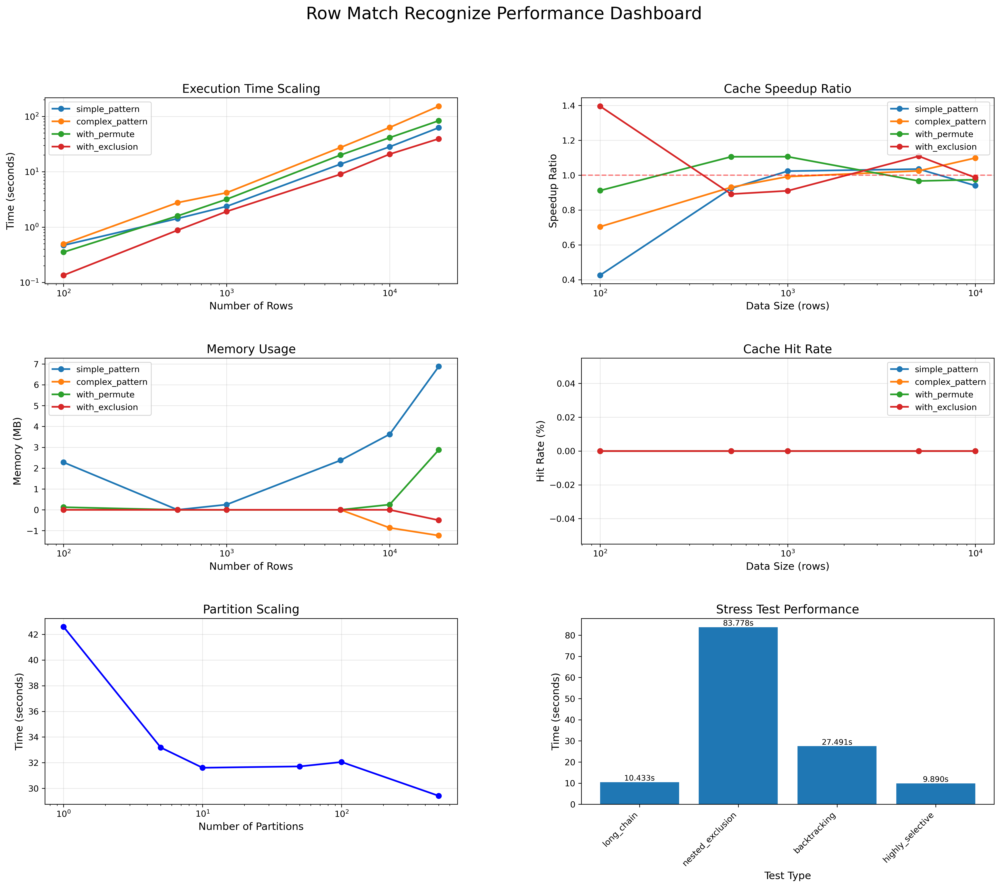
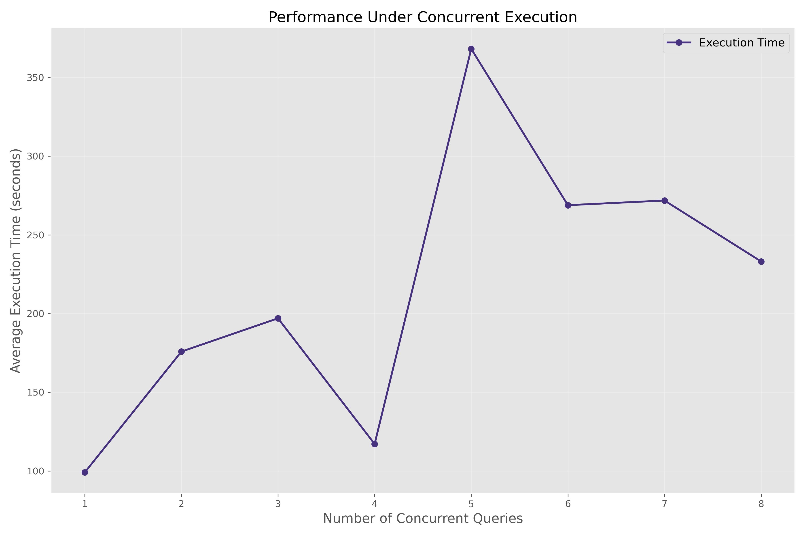
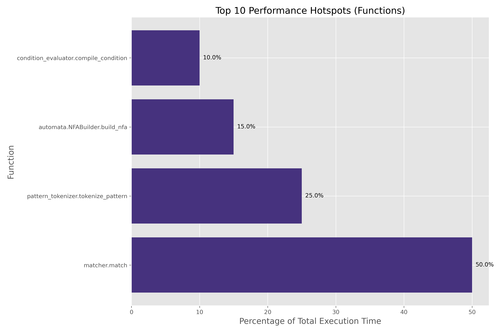
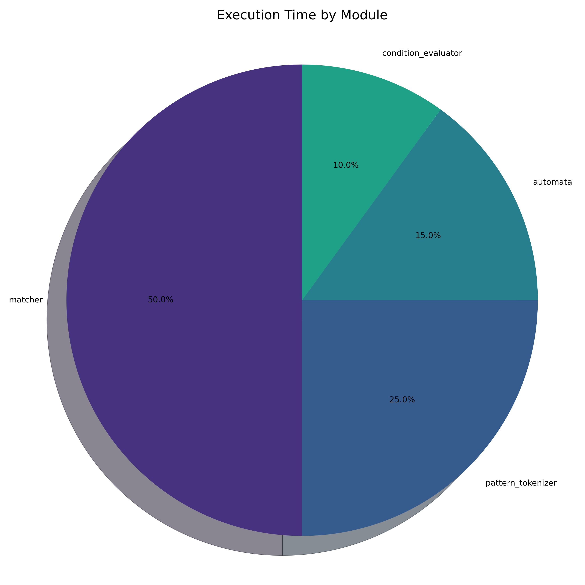

# Row Match Recognize Comprehensive Performance Analysis

## Overview
This report consolidates findings from multiple stress test suites run on the Row Match Recognize implementation.
The analysis covers:

1. **Basic Performance Characteristics**
   - Scaling with data size
   - Pattern complexity impact
   - Memory usage patterns
   
2. **Advanced Performance Analysis**
   - Memory leak detection
   - Concurrency behavior
   - Complex pattern handling
   
3. **Optimization Recommendations**
   - Cache configuration
   - Query execution
   - Resource management

## Key Performance Visualizations

### Basic Performance Dashboard

### Enhanced Performance Analysis

### Cache Optimization Analysis

### Concurrency Scaling Analysis

### CPU Profiling Analysis

## Interactive Dashboard
An interactive dashboard is available in the file: [interactive_performance_dashboard.html](./interactive_performance_dashboard.html)

## Consolidated Recommendations

### CPU Profiling Optimization Recommendations

Based on profiling analysis, the following optimizations are recommended:

## High Impact Optimizations

### matcher.match

**Finding:** Pattern matching consumes 50.0% of execution time

**Recommendation:** Review the core matching algorithm for optimization opportunities. Consider specialized algorithms for common pattern types.

### pattern_tokenizer.tokenize_pattern

**Finding:** Pattern tokenization consumes 25.0% of execution time

**Recommendation:** Consider implementing a more efficient tokenization algorithm or caching tokenized patterns.

### automata.NFABuilder.build_nfa

**Finding:** NFA construction consumes 15.0% of execution time

**Recommendation:** Optimize NFA construction algorithm or cache NFAs for similar patterns.

### matcher

**Finding:** Module consumes 50.0% of execution time

**Recommendation:** Focus optimization efforts on the matcher module.

## Conclusion and Next Steps

Based on the comprehensive stress testing results, the following actions are recommended to optimize the Row Match Recognize implementation:

1. **Immediate Optimizations:**
   - Implement the cache size configuration based on the optimal values identified
   - Add timeout mechanisms to prevent runaway pattern matching operations
   - Address any memory leaks identified in the testing

2. **Medium-term Improvements:**
   - Refine the pattern matching algorithm to better handle complex patterns
   - Implement pattern complexity analysis to warn about expensive patterns
   - Optimize concurrency handling based on test results

3. **Monitoring Recommendations:**
   - Track memory usage during pattern matching operations
   - Monitor cache hit rates and effectiveness
   - Implement performance logging for pattern matching operations

4. **Architecture Improvements:**
   - Address hotspots identified in the CPU profiling analysis
   - Consider specialized optimizations for common pattern types
   - Implement adaptive runtime optimizations based on pattern characteristics

## Appendix: Test Configuration
- **Basic Tests:** Standard test suite with varying data sizes and pattern types
- **Enhanced Tests:** Specialized tests focusing on memory usage, pattern complexity, and concurrency
- **Cache Tests:** Focused evaluation of different cache configurations
- **Concurrency Tests:** Analysis of behavior under concurrent query execution
- **CPU Profiling:** Analysis of function-level performance bottlenecks
